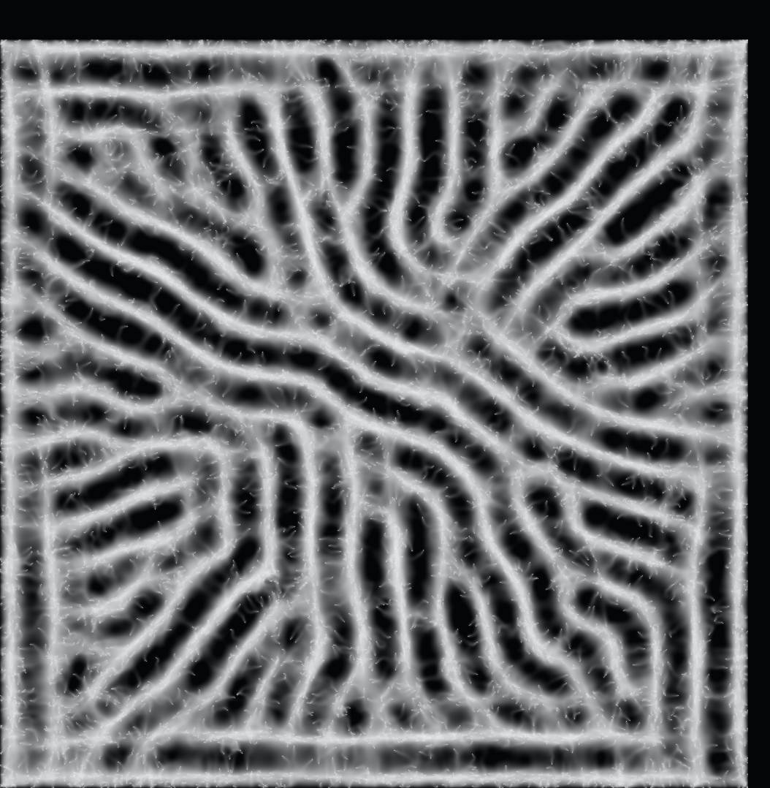
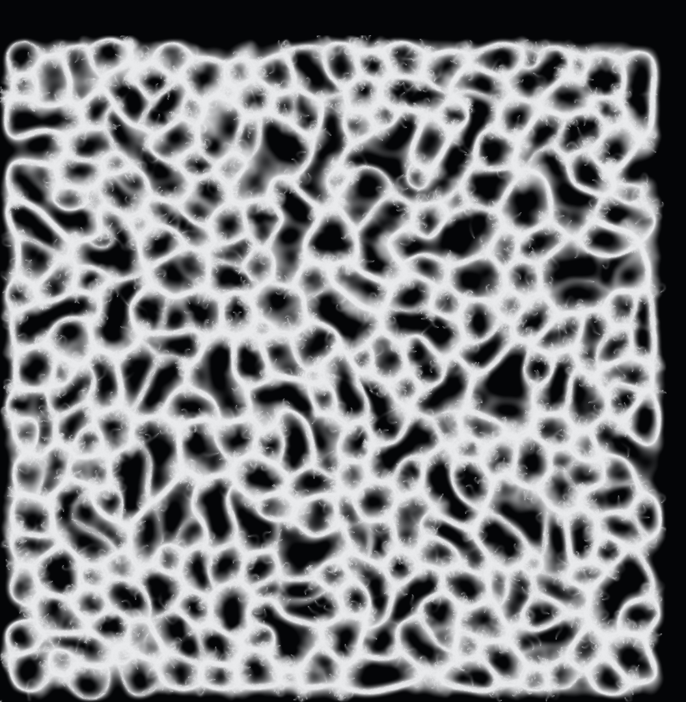
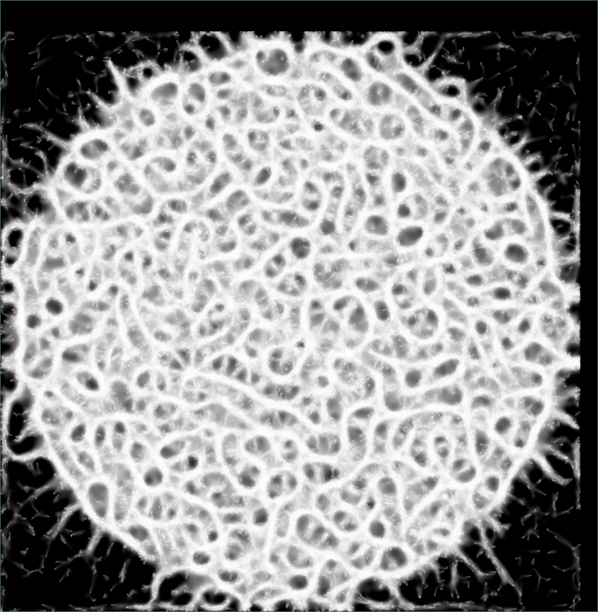
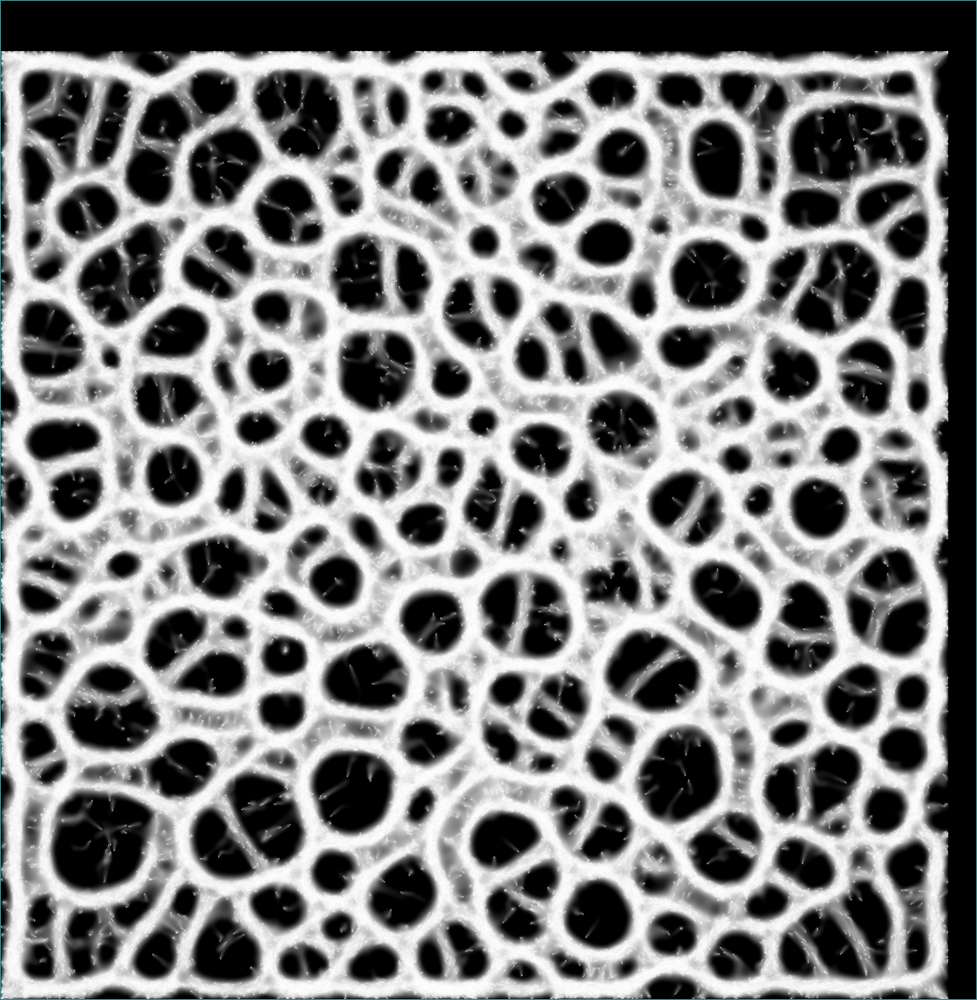

# Shaders :)

I'm experimenting with compute shaders &amp; shaders in general.

Right now, there's just a slime simulation. I replicated Sebastian Lagues [video](https://www.youtube.com/watch?v=X-iSQQgOd1A).

Here are some screenshots of what I was able to produce:

